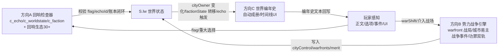

# 《艾尔达大陆·群雄割据》LW 超大型拓展 · 下一步三大方向详细设计 v1（2026-09-13）

> 本文档承接 v95（LW 活的世界模拟层 S1-S5 全落地），针对「下一步 1 / 2 / 5」三个方向展开**超大型拓展**的详细蓝图（非实施方案）。
> 用途：①与用户对齐三大方向的愿景、边界与验收标准；②作为后续各批次实施方案的总纲；③供 elda-content-author / elda-story-guard / elda-ci-guard 引用红线与验证要求。
> 关联：v95 LW 引擎（`src/script_19.js` 22 API + `src/data_nodes/dn_lw_world.js` 数据层）已上线，本蓝图全部在其上"增强不覆盖"。

---

## 0. 总览：三个方向如何咬合

**一句话**：方向 A 给世界装上"记账的规矩"（检查器），方向 B 让世界真正"打起来"（战争引擎），方向 C 让世界"写自己的史书"（编年史自动化）。三者共享同一套 `S.lw` 世界状态，按"规矩 → 变化 → 记录"的闭环互相喂数据：



**版本批次建议**（详见 §5）：v96 = A1+B1（检查器立规矩 + 战争引擎地基）；v97 = B2+B3（城市易主 + 战争事件 + 功罪）；v98 = A2+A3+C1（回响生态 + 账本融合 + 编年史双册）；v99 = C2+C3（时间线 UI + 作者语法 + 全量覆盖）。也可按用户节奏合并批次，原则是**每批可独立验收、逐批发布**。

---

## 1. 方向 A：回响检查器与回响生态（Echo Vault）

### 1.1 现状基线（v95 实测）

| 资产 | 现状 | 位置 |
|---|---|---|
| 回响登记 | `LW_echoScan`：flag 命中 echoMap → 入队 `S.lw.echoes` | script_19.js |
| 回响触发 | `LW_echoTick`：delay 到期 / at 地点命中 → echoLog + writePar 播报 + newsAdd + journalAdd | script_19.js |
| 回响渲染 | `[echo:id:文案]`（已触发才显示）/ `{{echoCount:id}}` / `{{npcRecall:角色|记忆id}}` | script_19.js LW_render |
| 回响锚点 | `LW_DATA.echoMap` 仅 4 条（灰港债务/公会背叛/教会垂青/兽人密约） | dn_lw_world.js |
| 自检 | `LW_selfcheck`：轻量（echoMap 字段非空 / npcSchedule / cityOwn 覆盖数） | script_19.js |
| 因果账本 | `CAUSALITY_LEDGER` 38+ 项（plant/reap/status/importance/irreversible），c_causality 自动核销 | dn_causality.js + c_causality.py |

### 1.2 缺口（为什么需要方向 A）

1. **回响锚点零机器校验**：echoId 重复、flag 未定义、at 地点不存在、delay 非法——目前全人工，写错只在玩家跑到时才发现。
2. **回响与因果账本两本账**：账本 open 伏笔不会自动进回响队列；作者写了 reap 核销节点，回响却不闭环——伏笔体系（CM-3）与回响体系（LW S3）脱节，违背"不能遗忘设定"。
3. **`S.lw` 无 schema 白名单**：echoes 队列无硬上限（设计承诺 ≤100）、journal 上限 60 已实现但字段无校验；未知键写入不会被抓住。
4. **回响密度太低**：4 条锚点撑不起"世界记得你"的体感，玩家可能几十天遇不到一次回响。
5. **回响只有"已触发/未触发"两态**：玩家无法感知"命运的线还在路上"（在途回响），神秘感没有出口。

### 1.3 系统设计

#### 1.3.1 三个新检查器（checks/c_echo.py、c_worldstate.py、c_faction.py）

**c_echo · 回响健康检查器（FAIL 级）**：

| 规则 | 判定 | FAIL 条件 |
|---|---|---|
| E1 锚点合法性 | 遍历 echoMap | flag 不在 src effects 写入集（复用 c_causality 的 flag 锚点扫描）/ echoId 重复 / delay∉[1,30] / at∉REGIONS 城市表 / text 空或 >120 字 |
| E2 引用健康 | 全文扫 `[echo:xxx`、`{{echoCount:xxx}}` | 引用的 echoId ∉ (echoMap ∪ 账本 id ∪ 白名单动态回响) → 悬空回响 |
| E3 账本闭环（登记制） | 账本 type=伏笔 且 status=open 的项 | 该项既无对应 echo 锚点、也无 reap 节点 → 登记 WARN（不阻断，供人工补） |
| E4 队列上限 | LW_echoTick 后 `S.lw.echoes.length` | >100 → FAIL（防状态膨胀） |
| E5 播报合规 | echoMap.text 遍历 | 含治理词超标 / 引号不成对 → FAIL（复用 c_textguard 词表） |

**c_worldstate · S.lw 白名单检查器（FAIL 级）**：

| 规则 | 判定 | FAIL 条件 |
|---|---|---|
| W1 顶层白名单 | `S.lw` 键集 | ∉ {season, dayPhase, echoes, echoLog, npcStates, factionRel, factionState, cityControl, warfronts, merit, guilt, worldChron, worldFlags, journal, tick} → 未知键 |
| W2 条目 schema | echoes / journal / worldChron 数组条目 | 缺必填字段（echoes:{id,at,delay,dueDay,text}；journal:{day,date,kind,text,flag}；worldChron:{day,kind,text,tag}） |
| W3 值域 | factionRel / merit / guilt 数值 | 非有限数 / 越界（factionRel∈[-100,100]，merit/guilt∈[0,1000]） |

**c_faction · 势力矩阵检查器（FAIL 级）**：

| 规则 | 判定 | FAIL 条件 |
|---|---|---|
| F1 基线一致 | `LW_DATA.factions[id].base` vs 引擎初始 infl | free≠10 / abyss≠-40 / 其余≠0 → 漂移 |
| F2 状态机值域 | factionState 取值 | ∉ {稳定,备战,战争,衰落,重整,潜伏} |
| F3 转移合法性 | 扫描 LW_factionTick / 未来 warTick 的状态赋值 | 非法转移（如 稳定→战争 不经 备战；abyss 潜伏→稳定）→ FAIL |
| F4 势力覆盖 | factions 键集 | ≠ 设定 8 势力 + abyss（9 键）→ 自创势力 |

**实施注意（v95 血泪教训）**：新检查器一律**只读构建产物 game.html / index.html**，strip 逻辑沿用 c_refhealth 修复后的方案（独立 <script> 块级扫描，禁对含 `\\"` 裸转义的整体剥串）；写 src 禁 `\\"` 模式裸转义双引号。

#### 1.3.2 回响生态扩展（内容 + 引擎旁路）

**echoMap 从 4 条扩到 30+**，按三层盘点来源：
- **账本伏笔转回响**：CAUSALITY_LEDGER 中 status=open 的伏笔（金秤血脉、圣痕司、封印节点等）→ 各配 1 条回响锚点（flag 用既有关键 flag，避免新增无主 flag）。
- **既有 flag 盘点**：从 src 提取高频 effects 写入 flag（如 v93/v96 系列重大选择 flag）→ 补回响。
- **新写双面回响**：同一 flag 配置"报答/反噬"双文案，按玩家后续行为（另一 flag 是否成立）分支渲染：

```js
// 双面回响 schema（echoMap 扩展字段）
{ flag:"lw_help_harbor", echoId:"echo_harbor_debt",
  delay:6, at:"free_huigang",
  text:"码头上那个你帮过的水手，托人捎来一句话：欠你的人情，我记着。",
  flip:{ flag:"lw_betray_harbor", text:"码头上那个水手远远看见你，转身走了。他记得你，也记得你后来的所作所为。" } }
```

**新作者语法 `{{echoPending:回响id}}`**（LW_render 扩展）：
- 回响在途（echoes 中有、echoLog 无）→ 渲染变体 A（"命运的线尚未收拢……"）
- 已触发 → 变体 B；无此回响 → 原文剔除。

**抉择记录册升级（LW_journalUI v2）**：
- 新增「在途回响」分页：列出 echoes 队列（第 N 日到期 / 需前往某地），"命运的账本"可视化。
- 已响条目保留在「已响」区（现状即可），标记触发日与地点。

#### 1.3.3 账本融合闭环

- **登记**：`LW_echoScan` 增加账本源——CAUSALITY_LEDGER 中 `plant` 成立的伏笔自动登记 `{id:"led_xx", at:reap 城市}`（不占 echoMap，走白名单动态回响）。
- **核销**：作者在 reap 节点写 `[echo:led_xx:核销文案]` → c_echo 校验该 id 已 closed → 回响闭环、账本可查。
- **可视化**：记录册「伏笔」分页显示账本 open 项 + 对应回响状态（呼应 elda-story-guard 的账本核销规则）。

### 1.4 内容配套预算

| 批次 | 新增内容 | 规模 |
|---|---|---|
| LW-A1 | 3 个检查器（c_echo/c_worldstate/c_faction）+ 既有代码合规修正 | 纯工具 + 零内容 |
| LW-A2 | echoMap 30+（账本伏笔转回响 15 + 既有 flag 回响 10 + 双面回响 5）+ echoPending 语法 + 记录册在途分页 | 1 数据文件 + 1 引擎旁路 |
| LW-A3 | 账本融合（plant 自动登记 / reap 核销联动 / 伏笔分页）+ c_echo 全绿 | 1 引擎旁路 + 修正 |

### 1.5 验收标准（可测试清单）

- [ ] 故意写悬空 echoId → c_echo FAIL 且报出 id；修正后 PASS
- [ ] 新增 10 个含 `[echo:]`/`{{echoCount:}}` 的既有节点文本，实测渲染正确
- [ ] 双面回响：两分支 flag 各走一遍，文案分别命中
- [ ] `{{echoPending:}}`：回响在途/已触发/不存在 三态渲染正确
- [ ] 记录册：在途分页正确显示到期日与地点
- [ ] 账本伏笔 plant 成立 → 自动登记回响；作者 reap → 核销闭环，账本 closed
- [ ] c_worldstate：往 S.lw 塞未知键 → FAIL

---

## 2. 方向 B：势力战争引擎（War Engine）

### 2.1 现状基线（v95 + 既有战争资产）

| 资产 | 现状 | 位置 |
|---|---|---|
| LW 势力静态层 | 9 势力基线（free=10/abyss=-40）、factionState 初值、cityOwn 九域静态归属（special tieren→east） | dn_lw_world.js |
| LW 势力旁路 | `LW_factionShift(id,delta,reason)` / `LW_factionTick`（五主线 flag→静态状态映射）/ `LW_cityOwner(loc)`（静态查询）/ `LW_factionUI`（列表） | script_19.js |
| v64 世界目标 | W64_WorldState / worldGoals / worldFame / w64Heard / w64Karma + 市场商品（7 商品市场，price/base 合法） | c_world.py 校验 |
| v65 战争系统 | W65_WAR：militaryCareer / warGrudges / army / warFame / warScars / mercenary + 军衔 8 级 + 兵种 9+ + 阵型 4 + grudgeAdd/grudgeLevel 恩怨账本 | c_war.py 校验 |
| 固定主线 | WORLD_EVENTS 五主线 day=60/120/200/250/280（purge/silver/seal/academy/orc） | script_01.js:17 |
| 随机事件池 | EVENT_POOL_EXT {id,day,cls(天灾/人祸/奇遇/商机),text}，checkWorldEvents 每 tick 触发 | script_01.js:19-124 |

### 2.2 缺口（为什么需要方向 B）

1. **城市控制是静态表**：永远不会易主——"铁门关被东军据守"是写死的，玩家打一百天也不变。
2. **势力状态机是静态映射**：purge→church备战、orc→north战争……只有 5 条死规则，无动态转移、无玩家影响。
3. **无战场/战局模型**：玩家无法"介入一场战争"——只能看文本，不能影响局部战场胜负。
4. **战争事件未进事件池**：攻城/粮道/谍报等战争剧本与 EVENT_POOL_EXT 脱节，玩家在战区旅行却遇不到战争。
5. **势力界面无城市/战争信息**：看不到谁控制哪座城、哪条战线在推进。
6. **功罪双轨（蓝图 S4-5）未实现**：只有好感（infl），没有"你为教会立过功/你对学院欠着罪"的细分账。

### 2.3 系统设计

#### 2.3.1 战局模型（warfront）

**数据表 `WARFRONTS`（dn_lw_world.js 扩展）**：

```js
window.LW_DATA.warfronts = [
  { id:"wf_tiebigate", cn:"铁门关拉锯", atk:"east", def:"north",
    cities:["tiebi","beijing"], winAt:100, loseAt:-100, weight:1.0,
    desc:"东军与北方公国的拉锯，铁门关是咽喉。" },
  { id:"wf_silverroad", cn:"银穗商路", atk:"east", def:"south",
    cities:["shangzhan","gangkou"], winAt:100, loseAt:-100, weight:0.8,
    desc:"东部王国提高银穗商路税收，商盟在备钱备粮。" },
  { id:"wf_abyss", cn:"封印七节点", atk:"abyss", def:"church",
    cities:["shengcheng","shendian","yiji"], winAt:100, loseAt:-100, weight:0.7,
    desc:"深渊教团在七处封印节点试探。教会圣战军枕戈待旦。" },
  { id:"wf_orc", cn:"北境狼旗", atk:"orc", def:"north",
    cities:["aierda","disanshao"], winAt:100, loseAt:-100, weight:1.0,
    desc:"黑石大汗整合半数部族，狼旗南指。" },
  { id:"wf_purge", cn:"净化令", atk:"church", def:"free",
    cities:["jiaohui","jishi"], winAt:100, loseAt:-100, weight:0.6,
    desc:"圣痕司审判官在各城邦搜查奥术痕迹，自由城首当其冲。" }
];
```

**状态结构（S.lw 扩展）**：

```js
S.lw.warfronts = {
  "wf_tiebigate": {
    phase:"僵持",            // 僵持 | 推进 | 易主 | 停战
    progress:0,              // -100..100；>0 攻方占优，<0 守方占优
    atk:"east", def:"north",
    history:[ {day:1, ev:"开局", d:0} ],   // 战史（编年史/回响数据源）
    lastShift:0
  }
};
S.lw.cityControl = { "tiebi":"east", "beijing":"north" };  // 动态覆盖表（空=用静态 cityOwn）
S.lw.merit = { "church":0, "east":0, ... };   // 功勋账
S.lw.guilt = { "church":0, "academy":0, ... }; // 罪责账
```

#### 2.3.2 引擎 API（script_19.js 扩展，全部旁路）

```js
/* 每日推进：所有战场按 weight + 世界事件修正 + 玩家偏移 推 progress */
window.LW_warTick = function(){ /* 挂 LW_tick 链，advanceDays 后执行 */ };

/* 玩家行为偏移战场（作者在节点 effects 或选项 effects 调用） */
window.LW_warShift = function(frontId, delta, reason){
  /* progress += delta; history.push({day,ev:reason,d}); 到达阈值 → LW_conquer() */
};

/* 城市易主核心 */
window.LW_conquer = function(frontId, winner){
  /* 1) 更新 S.lw.cityControl[cities] = winner
     2) LW_newsAdd("war", "【战报】"+城市+"落入"+势力+"之手");
     3) LW_journalAdd + LW_chronAdd（方向C自动成册）
     4) 对 loser 势力 LW_factionShift(loser,-5, "丢失城市") / winner +5
     5) warfronts 状态 → 易主/停战 */
};

/* 功罪双轨 */
window.LW_deed = function(facId, kind, amount, reason){
  /* kind:"merit" → S.lw.merit[facId]+=amount；"guilt" → S.lw.guilt[facId]+=amount
     journalAdd + 势力界面显示 */
};
```

**LW_cityOwner 动态化**（改造现有函数，向后兼容）：
`查 S.lw.cityControl[city] → 命中返回；未命中 → 兜底 LW_DATA.cityOwn（现状逻辑不变）`。

**作者语法/选项 effects 扩展**（v96_optGate effects 旁路）：
```js
// 选项 effects 支持 war 键：
{ war:{ id:"wf_tiebigate", d:15, reason:"你率队驰援铁门关" } }
// 选项门控支持 deed 键（功罪）：
cond: { deed:{ id:"church", op:">=", v:30, reason:"教会视你为功勋之人" } }
```

#### 2.3.3 战争事件接入事件池

- 新增 `WAR_EVENTS` 表（事件模板）：攻城/粮道/谍报/火攻/屠城/停战谈判，各含 `{front, city, cls, text, warDelta, inflEffect}`。
- `LW_warEventPool()`：玩家所在城市属于某 warfront 战区 → 该战争事件进入 EVENT_POOL_EXT 抽取候选（加权）。
- 事件后果：warShift 偏移 + 势力关系 + 声望 + 可能的城市易主。
- **增强不覆盖**：五主线（WORLD_EVENTS）固定日程优先级不变；战争引擎只在主线间隙/侧面生效，不篡改主线触发与结果。

#### 2.3.4 势力界面 v2（LW_factionUI 升级）

- 每势力卡片：状态机 + 关系 + **功勋/罪责** + **控制城市列表** + 参与的战场（进度条）。
- 新增「战场总览」tab：各战场 atk vs def、progress 进度条、history 战史（最近 5 条）、玩家可介入入口（当玩家位于战区城市时显示"投身战场"选项）。
- 城市易主视觉：势力卡片城市列表实时刷新（无地图改版，桌面端文本界面为主）。

#### 2.3.5 城市易主的影响链（复用 B10 地点联动 + 7 商品市场）

| 影响面 | 机制 |
|---|---|
| 节点 desc | 作者在节点写 `[[if:world.city=='east'|易主版|原版]]`（LW_render 已支持 city 键，v95 已实现） |
| 选项门控 | `cond.city`（v95 已实现）→ 易主后门控自动翻转 |
| 物价 | 易主城市所属市场商品 price 偏移（联动 v64 市场系统，±10%~30%） |
| NPC 日程 | 战区城市 NPC 日程迁移（可选二期：NPC 逃难/投靠） |
| 回响 | 易主自动登记回响（方向 A 的 echo 队列） |
| 编年史 | 易主自动成册（方向 C） |

### 2.4 检查器设计（c_war 扩展 + 新 c_warfront）

**c_warfront（FAIL 级）**：

| 规则 | 判定 | FAIL 条件 |
|---|---|---|
| BF1 战场表合法 | WARFRONTS 遍历 | atk/def ∉ factions / cities ∉ 城市表 / winAt≤0 / weight≤0 |
| BF2 战局状态机 | S.lw.warfronts phase | ∉ {僵持,推进,易主,停战}；非法转移（如 停战→推进 不经 僵持） |
| BF3 城市控制 | S.lw.cityControl 遍历 | city ∉ 城市表 / owner ∉ factions / 与 static cityOwn 冲突（special 键不可覆盖） |
| BF4 功罪值域 | merit/guilt | 非有限数 / <0 / >1000 |
| BF5 增强不覆盖 | 扫描 warTick/conquer | 存在改写 WORLD_EVENTS day/触发逻辑的代码 → FAIL（红线守护） |
| BF6 引用健康 | 全文扫 `cond.deed:`、`{war:...}` | 引用 warfront/deed id 不存在 → 悬空 |

### 2.5 内容配套预算

| 批次 | 新增内容 | 规模 |
|---|---|---|
| LW-B1 | WARFRONTS 5 战场 + warfronts 状态 + LW_warTick/LW_warShift + c_warfront 骨架 | 1 数据文件 + 1 引擎旁路 + 1 检查器 |
| LW-B2 | 城市易主动态化（LW_conquer/LW_cityOwner 动态）+ 影响链（desc 双版本样例 8~12 处/物价/回响）+ 易主播报 | 引擎 + 节点标注（只加条件不改文本） |
| LW-B3 | 战争事件 WAR_EVENTS 8~12 条接入事件池 + 功罪双轨 + 势力界面 v2（战场总览）+ c_warfront 全绿 | 数据 + 引擎 + UI |

### 2.6 验收标准（可测试清单）

- [ ] bu 注入 `LW_warShift("wf_tiebigate", 100, "测试")` → progress=100 → 城市易主 → `LW_cityOwner("tiebi")` 返回 "east" → 该城节点 `cond.city` 门控翻转
- [ ] 易主后：news 出现战报、编年史（若 C 已上线）成册、记录册有立场条目
- [ ] 战区城市旅行时：战争事件可触发（权重生效），后果影响 progress
- [ ] 势力界面：战场进度条 + 功罪 + 控制城市实时正确
- [ ] 五主线回归：purge/silver/seal/academy/orc 触发日与结果与 v95 完全一致（增强不覆盖验证）
- [ ] `cond.deed:{church,>=,30}` 门控：玩家为教会立 30 功 → 选项出现

---

## 3. 方向 C：世界编年史自动化（Chronicle Engine）

### 3.1 现状基线（v92 编年史 + LW journal）

| 资产 | 现状 | 位置 |
|---|---|---|
| v92 编年史 | CHRONICLE_RULES（eventType/match）+ `v92_chronicleAdd/Check/Review` + writeNext 钩子（/upg17inj:cron/ 记录 + /upg17inj:review/ 结局回顾注入）+ applyDefaults 兜底 S.chronicle + 手记面板编年史分页（/upg17inj:jtabs/） | c_chronicle.py 校验 |
| LW 抉择记录册 | `LW_journalAdd(kind,text,flag)`：60 条滚动；记录 echo/faction/抉择 | script_19.js |
| 世界要闻 | S.news.list（v93_newsAdd 追加） | script_03.js |

### 3.2 缺口（为什么需要方向 C）

1. **编年史靠作者手动**：作者在每个节点手动 `v92_chronicleAdd` 才入册——覆盖不全、易漏、无世界侧视角。
2. **玩家册与世界册不分**：玩家"今天帮水手卸货"和"铁门关易主"混在一册，世界大事的史诗感被稀释。
3. **无时间线视图**：现有手记分页是列表，不是按日/按季节的时间线。
4. **世界自动成册为零**：季节更替、城市易主、势力更替、回响触发、天灾奇遇——这些"世界大事"没有任何自动记录。

### 3.3 系统设计

#### 3.3.1 双册模型

- **玩家册（Player Chronicle）**：沿用 S.chronicle + v92 机制，自动钩子补强——重大 flag 变更（v96/v93 系列）、结局前置、关系转折自动 `v92_chronicleAdd`（作者仍可显式追加）。
- **世界册（World Chronicle）**：新增 `S.lw.worldChron`（滚动上限 300 条），由引擎自动成册：

```js
S.lw.worldChron = [
  { day:1,  season:"春", phase:"晨", kind:"world", tag:"开局",
    text:"无名旅者从灰港渡船走下。大陆在七锚之下，诸国并立。" },
  { day:57, season:"春", phase:"昏", kind:"season", tag:"季节",
    text:"河面的冰裂了，城里到处是潮湿的土腥气。" },  // 示例：换季自动
  { day:105,season:"夏", phase:"午", kind:"festival", tag:"节日",
    text:"仲夏火把节，自由城彻夜灯火。" },            // 示例：节日自动
  { day:120,season:"夏", phase:"夜", kind:"main", tag:"主线",
    text:"东部王国提高银穗商路税收，铁门关方向战云密布。" }, // 主线触发自动
  { day:135,season:"夏", phase:"晨", kind:"war", tag:"城市易主",
    text:"铁门关落入东部王国之手。北方公国的旗帜被换了下来。" } // 战争引擎喂入
];
```

#### 3.3.2 自动成册规则表（CHRON_AUTO_RULES）

```js
window.LW_DATA.chronAuto = [
  { match:"season",      kind:"season",  tag:"季节", tpl:"时令入{season}。{line}" },
  { match:"mainEvent",   kind:"main",    tag:"主线", tpl:"{cn}爆发——{text}" },          // WORLD_EVENTS 触发
  { match:"cityOwner",   kind:"war",     tag:"城市易主", tpl:"{city}落入{owner}之手。" }, // warfront 喂入
  { match:"factionState",kind:"faction", tag:"势力", tpl:"{fac}进入{state}。" },
  { match:"echo",        kind:"echo",    tag:"回响", tpl:"{text}" },                     // 回响触发
  { match:"omen",        kind:"omen",    tag:"传闻", tpl:"{text}" },                     // 主线预热
  { match:"festival",    kind:"festival",tag:"节日", tpl:"今日{name}：{desc}" }          // FESTIVAL_V93
];
```

**引擎**：

```js
/* 每日差异对比：监控字段（season/主线触发/城市控制/势力状态/echoLog 增量/节日）→ 生成新条目 */
window.LW_chronTick = function(){
  /* 与 S.lw.worldChron 已有 tag+day 对比，新增差异条目；上限 300 滚动 */
};

/* 作者显式追加（节点内） */
window.LW_chronAdd = function(kind, text, opts){ /* 世界册 */ };
```

**作者语法（LW_render / writePar 链扩展）**：
- `[chron:世界|文案]`：节点内显式追加世界册条目（如"你站在城头，看着铁门关的旗帜换了颜色"）
- `[chron:玩家|文案]`：追加玩家册条目
- `{{chronCount:tag}}`：某 tag 事件累计次数回显（如"你见证过 3 次城市易主"）

#### 3.3.3 编年史 UI v2（v92_chronicleReview 升级 + 手记集成）

- **时间线双列视图**：左列世界大事（worldChron）、右列玩家足迹（player chronicle），按 day 对齐；跨页时按季节/主线阶段分组（"春一月"、"净化令前夕"）。
- **过滤**：按 kind（季节/主线/战争/回响/节日/传闻）/ 按 tag / 按地区。
- **章节标记**：季节切换与主线触发自动生成章标题（史诗感来源）。
- **手记集成**：手记面板「编年史」分页升级为时间线（保留 v92 结局回顾注入 /upg17inj:review/）。

### 3.4 检查器设计（c_chronicle 扩展）

| 规则 | 判定 | FAIL 条件 |
|---|---|---|
| C1 规则表合法 | CHRON_AUTO_RULES 遍历 | match 键 ∉ 可监控字段集 / tpl 空 / kind 非法 |
| C2 世界册 schema | S.lw.worldChron 条目 | 缺 day/kind/text/tag / 非有限 day |
| C3 引擎存在 | window 函数 | LW_chronTick/LW_chronAdd 缺失（旁路未挂） |
| C4 自动成册覆盖率（登记制） | 对 major 事件类型（季节/主线/易主/回响/节日） | 缺对应 match 规则 → WARN 登记（不阻断） |
| C5 上限 | worldChron.length | >300 → FAIL |
| C6 双册不混 | 扫 LW_chronAdd 调用 | 未指定册别（kind 缺失）→ FAIL |

### 3.5 内容配套预算

| 批次 | 新增内容 | 规模 |
|---|---|---|
| LW-C1 | 双册模型 + LW_chronTick/LW_chronAdd + 自动成册规则表首批（季节/主线/易主/回响）+ c_chronicle 扩展 | 引擎 + 数据 + 检查器 |
| LW-C2 | 编年史 UI v2（时间线双列 + 过滤 + 章节分组）+ 手记集成 | UI 旁路 |
| LW-C3 | 作者语法 [chron:]/{{chronCount:}} + 规则全覆盖（天灾/奇遇/节日/传闻）+ 全量回归 | 引擎 + 数据 |

### 3.6 验收标准（可测试清单）

- [ ] bu 快进 30 天：worldChron 自动含季节条目（若跨季）/ 主线传闻 / 回响触发条目
- [ ] 战争引擎易主 → worldChron 自动出现"城市易主"条目（与方向 B 联动）
- [ ] 玩家重大选择 → 玩家册自动条目（v92 钩子生效）
- [ ] 时间线 UI：双列正确、按 day 对齐、可过滤、季节分组标题正确
- [ ] `[chron:世界|...]` / `{{chronCount:tag}}` 实测渲染正确
- [ ] c_chronicle 扩展：规则表缺 match → FAIL；塞非法条目 → FAIL

---

## 4. 三方向共享的地基

| 项 | 约束 |
|---|---|
| 存档兼容 | 新增状态全进 `S.lw` 子对象 + applyDefaults 兜底；saveVersion=48 永不变；每批实测读旧档 |
| 预算 | 每批 `elda budget --reason "<真实理由>"` 合法更新（当前 baseline 19,071,461B；chunked 上限 8,500,000B；节点下限 5,586） |
| 红线 | 判定公式 / writeNext 核心语义 / choose / 存档结构语义 不触碰；新代码走 `window.LW_*` 旁路；节点只增不降；文本不删句不改既有选项语义 |
| 增强不覆盖 | 五主线固定日程优先；战争引擎/回响/编年史只在主线间隙与侧面生效，绝不篡改 WORLD_EVENTS 触发与结果 |
| 设定一致 | 8 势力 + abyss / 五主线 day / 七锚 / 铁牌 / 神谕 / 金秤 / 晨天 严格一致；新事件/新节日登记因果账本 |
| 验证链 | 每批：备份（elda backup）→ story-guard 把关 → `ci_guard.py --build`（41+ 检查器）→ smoke → bu 浏览器实测 → `elda test all` → 提交推送 → 版本记录 |
| 桌面端 | 永久不做移动端适配（桌面 1920×1080 基准） |
| 去 AI 味 | 新增文案按白描、有细节、无模板感标准（doubao-human-signal 约束） |

---

## 5. 推荐版本路线

| 版本 | 批次 | 一句话 | 依赖 |
|---|---|---|---|
| **v96** | LW-A1 + LW-B1 | 检查器立规矩（c_echo/c_worldstate/c_faction/c_warfront 骨架）+ 战争引擎地基（5 战场 + warTick/warShift） | v95 |
| **v97** | LW-B2 + LW-B3 | 城市易主动态化 + 影响链 + 战争事件入池 + 功罪双轨 + 势力界面 v2 | v96 |
| **v98** | LW-A2 + LW-A3 + LW-C1 | 回响生态 30+（含双面回响/在途分页）+ 账本融合闭环 + 编年史双册自动成册 | v96（C1 吃 B2 的易主事件） |
| **v99** | LW-C2 + LW-C3 | 编年史时间线 UI + 作者语法 + 全量规则覆盖 | v98 |

> 顺序逻辑：**先立规矩（A1）再让世界动起来（B1）→ 动起来后能易主、能打仗（B2/B3）→ 这时回响生态才有足够素材（A2/A3）→ 最后编年史把这一切自动写成史书（C1-C3）**。也可按用户节奏合并（如 v96 直接 A1+B1+B2），每批独立验收即可。

---

## 6. 风险与对冲

| 风险 | 对冲措施 |
|---|---|
| 战争引擎与五主线剧本冲突 | "增强不覆盖"：warfront 只影响局部城市/局部战场；c_warfront BF5 检查器守护（改写 WORLD_EVENTS 即 FAIL）；每批跑 `elda test all` 验证主线触发日与结果不变 |
| 城市易主破坏既有节点文本 | `[[if:world.city==|易主版|原版]]` 双版本机制（v95 已支持）；未标注城市维持原文本；只加条件不改原文 |
| 状态膨胀（存档/性能） | schema 白名单（c_worldstate）+ 上限（echoes≤100 / journal≤60 / worldChron≤300 / merit·guilt≤1000）+ applyDefaults 兜底 |
| 检查器误报（v95 `\\"` 教训） | 新检查器只读构建产物、按独立 <script> 块级扫描；写 src 禁 `\\"` 裸转义；先隔离验证再全量 |
| 回响/账本两本账脱节 | c_echo E3 登记制扫描 + 账本融合闭环（plant→自动登记、reap→核销联动） |
| NPC 日程迁移 OOC | story-guard 预检/终检；迁移仅限设定允许的行为 |
| 玩家感知不到"世界活了" | 三个可见窗口：回响记录册在途分页（A）/ 战场进度条 + 易主战报（B）/ 编年史时间线（C）——每批必须有一个可见窗口落地 |

**红线复核**：判定公式 / writeNext 核心语义 / choose / 存档语义 / saveVersion=48——全部旁路（window.LW_*），只读 S 状态、追加渲染；节点只增不降；文本不删句不改既有选项语义。

---

## 7. 与其它方向的关系

- **方向二（命运长线与 NG+）**：编年史世界册（C）+ 抉择记录册（A）即 NG+ 继承的数据源——v99 完成后可直接升级多周目继承。
- **方向三（战斗/成长/经济三件套）**：战争引擎（B）的城市易主物价联动即动态经济的地基；战场胜负可为战斗演出提供剧情前提。
- **方向四（动态支线）**：deed 功罪门控 + cond.city 易主门控 = 动态支线的成熟条件（v96 起即可用）。

**推荐组合**：v96-v97（A1+B1→B2+B3）→ v98-v99（A2+A3+C1→C2+C3）→ 方向二 NG+。
