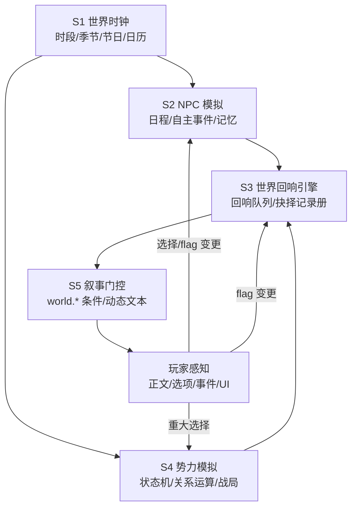

# 《艾尔达大陆·群雄割据》活的世界模拟层（Living World）
## 超大型拓展方向设计 v1（2026-09-12）

> 本文档是「方向一 · 活的世界模拟层」的超大型拓展方向蓝图（非实施方案）。
> 用途：①与用户对齐愿景与边界；②作为后续 LW-1~LW-5 批次实施方案的总纲；③供 elda-content-author / elda-story-guard / elda-ci-guard 引用红线与验证要求。
> 关联：V96-OPT 选项与文本推进链接（12 项已上线）是本方向的地基。

---

## 1. 愿景

**一句话**：让艾尔达大陆拥有自己的"呼吸"——世界在玩家看不见的地方持续运转，玩家的每个选择都被世界记住，并在未来以剧情"回响"的方式回报或反噬。

**三个体验目标**：
1. **世界是活的**：NPC 会移动、季节会变、战争会推进、城市会易主。
2. **选择有意义**：玩家的抉择被世界记住，并在未来数日/数月后以剧情回响兑现。
3. **故事是独有的**：不同玩家的世界状态不同，剧情体验随之分化（千人千面）。

**核心洞察**：游戏已有 5,600+ 节点 / 95 事件 / 因果账本 38+ 项——内容资产巨大但基本是"静态陈列"。本方向的核心不是"再写更多内容"，而是**为既有内容装上驱动引擎**，让存量资产被激活。

---

## 2. 设计原则（铁律，任何批次不得违反）

1. **红线不触碰**：判定公式 / writeNext 核心语义 / choose / 存档结构语义 / saveVersion=48（不可变）。
2. **增强不覆盖**：模拟层在既有固定剧本（五主线）的间隙与侧面生效，五主线固定日程优先，模拟层绝不篡改其触发与结果。
3. **旁路接入**：所有新代码走 `window.LW_*` 旁路模块（沿用 v96_* 模式），只读 S 状态、追加渲染，不动引擎核心。
4. **存档兼容**：新增状态全部进 `S.world` 独立子对象 + applyDefaults 兜底；saveVersion 不变；每批实测读旧档。
5. **节点只增不降**；文本不删句、不改既有选项语义。
6. **设定一致**：8 势力 / 五主线(purge 60/silver 120/seal 200/academy 250/orc 280) / 七锚 / 铁牌 / 神谕 / 金秤 / 晨天 严格一致；新节日/新事件登记因果账本。
7. **桌面端优先**（永远不做移动端适配）。
8. **每批必过流水线**：备份 → 设计 → story-guard 把关 → 验证链全绿（ci_guard --build）→ 提交推送 → 版本记录。

---

## 3. 系统架构总览

**数据流**：S1 驱动时钟 → S2/S4 按时钟推进 NPC/势力状态 → 状态变更写入 `S.world` → S3 将关键变更转为回响队列 → S5 把世界状态暴露给叙事层（条件门控/动态文本）→ 玩家在正文/选项/事件/UI 中感知 → 玩家的选择再反向驱动 S2/S3/S4（闭环）。

---

## 4. 子系统详细设计

### S1 · 世界时钟与时间推进（World Clock）

**现状基线**：`S.day` 已存在；五主线按 day 触发；EVENT_POOL_EXT 95 事件按 day 抽取。但世界时间基本"休眠"——只在玩家行动时被动推进，无时段/季节概念。

**设计**：
1. **时段层（dayPhase）**：晨/午/昏/夜四时段，由 S.day 派生。影响：
   - NPC 出现位置（供 S2 使用）
   - 节点/选项的时段条件（如"入夜后铁门关戒严，无法通行"）
   - 事件池抽取权重（夜间更易触发奇遇/天灾/夜袭）
2. **季节历（season）**：以 day 周期轮换（建议 30 天一季，可调）。影响：
   - 城市 desc 的季节前缀（复用 B10 地点联动做季节修饰：冬雪/夏旱/秋收）
   - 天灾类型权重（冬雪灾/夏旱灾/春汛）
   - 商机池变化（秋收粮价/冬季物资紧缺——联动 7 商品市场）
3. **世界历 UI（World Calendar）**：玩家可查"艾尔达历"：当前日期/季节/未来 7 天事件预告（主线预热、节日、天灾预警）。**这是玩家感知"世界在运转"的第一窗口。**
4. **节日系统**：按既有世界设定登记节日（若有金秤节/圣辉祭等设定则严格采用；若没有则登记新节日入账本）。节日期间：特定城市专属事件、物价浮动、NPC 聚集。
5. **倒计时预热**：主线事件前 3 天，全图 NPC 随机谈论传闻（"听说北境要出大事了……"），制造临近感。

### S2 · NPC 独立生活与记忆（NPC Sim）

**现状基线**：NPC_NET（网络/关系数据）、`S.npcRelations`（玩家好感）、changeRelation（script_02c.js:425）；NPC 基本站桩——只在玩家访问时触发固定对话。

**设计**：
1. **NPC 日程表（schedule）**：关键 NPC（金秤家族/鬃吼/腐光/秦·长风/灰鬃/林歌/灰袍若耶/艾德蒙/沈砚/白驼/大汗/青叶/枢机·克莱门特/枢机·奥黛拉 等）每人一张"时段×地点"日程。玩家在非日程地点找他 → 反馈"他去了别处/你扑了个空"；在日程地点重逢。
2. **NPC 自主事件（sim events）**：NPC 之间由模拟器按权重 + 玩家行为推进的后台事件（结盟/仇杀/交易/争执/私奔），写入 `S.world.npcStates`。玩家撞见时以事件文本呈现（复用 EVENT_POOL_EXT 注入机制）。
3. **NPC 记忆银行（memory bank）**：每个关键 NPC 维护对玩家的记忆条目（由 flag 变更/重大选择自动或作者标注生成）。重逢时以 `{{npcRecall:角色|记忆id}}` 回显旧事（"上次你在灰港欠我的人情"）。**复用并扩展 v96_choiceEcho 的替换机制，新增 LW 渲染钩子。**
4. **关系动态化**：NPC 对玩家的态度 = npcRelations + 世界事件修正（玩家与敌对势力结盟 → 友方 NPC 冷淡/警惕）。
5. **书信系统（可选，LW-2 二期）**：NPC 通过信使给玩家寄信（触发式文本 + 可回复选项），让远距离 NPC 关系"活"起来。

### S3 · 世界回响引擎（Echo Engine）★ 本方向核心亮点

**现状基线**：dn_causality.js 因果账本（plant/reap/status/world 四字段），伏笔核销全靠作者手工写 reap 节点。

**设计**：
1. **回响队列（echo queue）**：`S.world.echoes = [{id, trigger, delay, at, after, node, text, seen}]`。
   - **来源**：①配置了回响映射的 flag 变更；②因果账本 plant 项自动登记；③势力关系偏移超阈值。
   - **触发条件**：延迟天数（delay: day+5）/ 地点条件（at: 城市）/ 前置事件（after: 事件id）。
   - **注入方式**：玩家进入相关节点/事件池时，回响以追加文本（[echo] 渲染）或附加选项形式出现；触发后 seen=true（一次性）。
2. **作者语法**：
   - `[echo:回响id:文案]`：按回响状态渲染（已触发→文案；未触发→原文剔除）
   - `{{echoCount:事件id}}`：数字回显（该事件被世界记住/发生的次数）
   - `{{npcRecall:角色|记忆id}}`：NPC 记忆回显
3. **抉择记录册（Fate Journal）UI**：玩家可查——
   - 我做过的重大选择（flag 快照 + 当时文本摘录）
   - 世界对此的回应（已触发回响列表）
   - 尚未触发的回响（"命运的线尚未收拢……"）
4. **与事件池联动**：回响可作为 EVENT_POOL_EXT 抽取的加权候选（玩家状态相关事件更容易出现）。
5. **账本融合闭环**：因果账本 open 项 → 自动进入回响队列 → 作者写 reap 节点时标记核销 → 回响闭环，机器可查（c_echo 检查器）。

### S4 · 势力动态模拟（Faction Simulation）

**现状基线**：8 势力基线立场矩阵（敌对 < -60 / 同盟 > 60）、七阶段战争、WORLD_EVENTS 固定推进。

**设计**：
1. **势力状态机**：每势力状态 ∈ {稳定, 备战, 战争, 衰落, 重整}；转移由 ①五主线阶段（世界事件）②玩家重大行为 驱动。
2. **关系运算器**：玩家重大选择按权重表偏移势力关系（例：帮教会打压学院 → 教会 +15 / 学院 -20）。偏移量计入 `S.world.factionRelations`，势力界面实时显示。
3. **动态战局**：七阶段战争主线固定，但玩家可影响局部战场（支援/破坏/中立）→ 战场胜负变量 → 影响后续节点文本与城市控制权。
4. **城市控制权（cityControl）**：战争推进中城市易主 → 城市 desc/选项/物价随控制势力变化（复用 B10 地点联动扩展；地图视觉标记为二期可选）。
5. **势力功勋/罪责双轨**：除好感外记录玩家对每势力的功勋与罪责，影响该势力的对待方式（礼遇/通缉/招揽/刺杀）。

### S5 · 世界状态快照与叙事门控（World State & Narrative Gating）

**设计**：
1. **世界状态对象**：`S.world = { day, dayPhase, season, factions:{...}, warStage, cityControl:{...}, npcStates:{...}, echoes:[...], worldFlags:{...}, calendar:[...] }`——独立存档键 + applyDefaults 兜底，saveVersion 不变。
2. **叙事门控扩展**：v96_optGate 的 cond 扩展支持：
   - `world.season: 'winter'`、`world.dayPhase: 'night'`
   - `world.faction: {id:'church', rel:'>60'}`
   - `world.city: 'tiebigate'`（控制权）
   - `world.echo: '事件id'`（回响存在/已触发）
   - `world.flag: 'xxx'`（世界级 flag，区别于玩家 flag）
3. **动态文本组装**：正文支持 `[[if:world.city=='city_x'|易主版文案|原版文案]]`（作者可选双版本，不删原文）。
4. **世界快照读档**：读档时恢复世界状态（与玩家存档同一键内子对象）。

---

## 5. 复用资产映射

| 现有资产 | 复用方式 | 所在位置 |
|---|---|---|
| `S.day` + WORLD_EVENTS | 时钟基础、五主线日程 | script_01.js:17 |
| EVENT_POOL_EXT（95 事件） | 回响注入池、事件日历 | script_01.js:19-124 |
| dn_causality.js 因果账本（38+ 项） | 回响队列登记/核销 | src/data_nodes/dn_causality.js |
| NPC_NET + `S.npcRelations` | NPC 日程/记忆/关系 | script_02c.js:425 |
| REGIONS 九域 + 城市 | 时段地点联动、城市控制权 | script_01.js:15 |
| v96_optGate cond | 扩展 world.* 条件门控 | script_03.js（v96-opt 模块） |
| v96_choiceEcho `{{choice:}}` | 扩展 `{{npcRecall:}}`/`{{echoCount:}}` | script_03.js（v96-opt 模块） |
| 7 商品市场 | 动态经济（季节/战争价格） | 设定文档 |
| 四路字节 + elda.py content/text | 验证链、内容挂接 | tools/elda/elda.py |

---

## 6. 分阶段路线图（LW-1 ~ LW-5）

> 每批均走：设计文档 → 备份（elda backup）→ 实现 → story-guard 把关 → ci_guard --build → bu 浏览器实测 → elda test all → 提交推送 → 版本记录。

| 批次 | 内容 | 依赖 | 交付验收标准 |
|---|---|---|---|
| **LW-1** | S1 世界时钟：时段/季节/世界历 UI/节日 | 无 | 世界历可查；时段/季节影响生效（节点条件+desc 修饰）；节日事件可触发 |
| **LW-2** | S2 NPC 模拟：20+ 日程表/自主事件/记忆银行 | LW-1 | NPC 会移动（非日程地点扑空）；重逢引用旧事；自主事件可触发 |
| **LW-3** | S3 回响引擎：回响队列/注入/抉择记录册/作者语法/账本融合 | LW-1, LW-2 | 选择后 N 天回响出现；记录册完整；c_echo 检查器全绿 |
| **LW-4** | S4 势力模拟：状态机/关系运算器/动态战局/城市控制权 | LW-1 | 势力界面实时；城市易主生效；战局分叉正确 |
| **LW-5** | S5 叙事门控强化：world.* 条件全量/动态文本/快照存档 | LW-1~LW-4 | 既有节点标注条件后门控正确；读档恢复世界状态 |

---

## 7. 内容配套预算（每批新增量估算）

| 批次 | 新增内容 |
|---|---|
| LW-1 | 世界历 UI 1 面板 + 3~5 个节日事件 + 季节 desc 修饰（复用既有城市，不新增城市） |
| LW-2 | 20+ NPC 日程表数据 + 10+ 重逢记忆文本 + 5 自主事件剧本 |
| LW-3 | 回响触发规则表（flag→回响映射）+ 首批 15~20 个回响锚点文本 |
| LW-4 | 势力状态机初始数据 + 战局分叉节点 8~12 个 + 城市易主文本 |
| LW-5 | 既有节点条件标注（只加条件不改文本）+ 动态文本双版本样例 |

**规模判断**：每批约 1~3 个 dn 文件或数据文件 + 1 个旁路 JS 模块，属"中型批次"；整体为 5 批超大型工程，建议按批次验收、逐批发布（符合用户"全部做进游戏更新"的惯例与 AGENTS.md 不重复/不遗忘要求）。

---

## 8. 验证与检查器

**每批必跑**：`node --check src` → `python ci_guard.py --build`（41 检查器）→ smoke → bu 浏览器实测 → `elda test all`（结局/事件回归）。
**禁止**单独跑 `elda ci`（幂等 verify 会反向 extract 还原 src）。

**新增检查器（elda ci 扩展，建议随 LW-1 引入骨架）**：
- `c_worldstate`：`S.world` schema 白名单校验（未知键 → FAIL）
- `c_echo`：回响队列死链/引用合法（echo id 存在、trigger 合法、reap 核销闭环）
- `c_faction`：势力关系矩阵一致性（-100~100 范围、基线不越界）

**存档兼容**：每批实测读旧档（saveVersion 48 不变、applyDefaults 兜底生效）。

**预算**：每批 `elda budget --reason "<真实理由>"` 合法更新（当前 baseline 19,044,030B）。

---

## 9. 红线与风险复核

| 风险 | 对冲措施 |
|---|---|
| 世界"活"但玩家感知不到 | S1 世界历 UI + S3 抉择记录册 + 回响可视化（三个玩家可见窗口） |
| 状态膨胀（存档/性能） | S.world 白名单 schema + 回响队列上限（如 ≤100 条滚动）+ applyDefaults |
| 与固定五主线剧本冲突 | "增强不覆盖"原则：模拟层只在主线间隙/侧面生效 |
| 预算持续增长 | 每批 budget 合法更新；LW 数据尽量走既有文件 |
| NPC 自主事件 OOC | story-guard 预检 + 终检；NPC 自主事件仅限设定允许的行为（不违背人设） |

**红线复核**：判定公式 / writeNext 核心语义 / choose / 存档语义 / saveVersion=48——全部旁路，LW 模块只读 S 状态、追加渲染，不触碰引擎核心；节点只增不降；文本不删句不改既有选项语义。

---

## 10. 与其它方向的关系

- **方向二（命运长线与 NG+）**：抉择记录册（S3）即其前身——LW-3 完成后可直接升级命运图谱/多周目继承。
- **方向三（战斗/成长/经济三件套）**：势力模拟（S4）可为动态经济/战场系统提供地基。
- **方向四（动态支线）**：世界状态门控（S5）就是动态支线的基础设施。

**推荐组合**：方向一（LW-1~LW-5）→ 方向二（NG+）→ 方向三（战斗演出）。

---

## 11. 下一步

用户确认方向后：按口令流水线生成 LW-1 实施方案（【口令 · 群雄割据 LW-1】请基于《群雄割据》完整知识，按三技能流水线实施：世界时钟子系统……铁律：备份→改动→把关→验证链全绿→提交推送；不触碰红线；节点只增不降；交付改动清单+验证结果+docs 文档）。
